# flameletCloudFoam
↑ [OxySim-129](../../../README.md)

This solver is meant for Lagrangian simulations with tabulated flamelet manifolds.

## Getting started

### Requirements
* FLUT 
* Boundary FLUT if there are walls
* `constant/flameletProperties` to define scalar transport equations, table lookup quantities, ...
* `constant/<name of your cloud>Properties` to define the properties, models, ... of your cloud
* *clouds* dictionary inside `system/controlDict` with the names of your clouds and their cloud type, e.g., `clouds { coalCloud   carbonaceousCloud; }`
* A mechanism file containing species that are relevant for the particles (e.g., O2, volatile species, or fuel mixture fraction Z)

**Why a mechanism file if the gas phase is tabulated?** The gas-phase equations themselves are
solved from the FLUT, but the particle submodels still need a real per-species thermodynamic
database — via `canteraThermo`, the cloud's OpenFOAM-framework "carrier phase" thermo — for two
things the table doesn't provide:
- Per-species molecular weight, formation enthalpy, and name→index lookups for reaction
  stoichiometry, e.g. `COxidationKineticDiffusionLimitedRateSTFS` looking up O2's and CO's
  `W`/`Hc`/`carrierId`.
- Per-species enthalpy at the particle's own temperature for the particle→gas enthalpy source
  term (`composition.carrier().Ha()`/`Hs()`), evaluated wherever devolatilization or
  char-oxidation products enter the gas phase.

Only the gas-phase species actually produced by the particle (its devolatilization products) need
to be defined in the mechanism — not the full gas-phase chemistry. If char oxidation is enabled
via the Baum-Street model (`surfaceReactionModel COxidationKineticDiffusionLimitedRateSTFS`), it
additionally needs O2 (the oxidizer) and CO (to look up `W`/`Hc` for the reaction) — but the
resulting char-oxidation CO is never added to that real `"CO"` carrier species; it's booked to a
separate dummy species (`dummySpecies` in the model's dict, e.g. `CO_dummy`) with the same
thermophysical properties, so it stays distinct from any CO already coming from devolatilization.
This separation matters because the transported mixture-fraction-like scalars are built from
`speciesWeights` sums over specific carrier species (see
[`flameletEquations`](../../../src/flamelet/flameletEquations/README.md)); without the dummy
species, char- and volatile-derived CO would land in the same carrier id and their source terms
would mix, corrupting any mixture-fraction equation meant to track only the volatile pathway. To
keep the species list short, the devolatilization products can also be lumped into a single
pseudo species, as long as its NASA polynomial coefficients are fit to reproduce the real product
mixture's cp, enthalpy, etc.

See [`canteraThermo`](../../../src/thermo/canteraThermo/README.md) for how it's otherwise unused
in the solver's time loop.

## How it works

The flameletCloudFoam solver is based on flameletFoam. 
Therefore, (almost) the same [equations](../../../src/flamelet/flameletEquations/README.md) are solved and the overall solver structure is similar. 
The equations that are solved with flameletCloudFoam contain a source term for the exchange between particle and gas phase (also called carrier phase). 
For versatility, clouds are managed by the [cloud handler](../../../src/CloudHandler/README.md), which reads the *clouds* dictionary from the `system/controlDict` to initialize the clouds in `createClouds.H`. 
During solution the cloud handler accumulates the particle source terms and adds them to the right side of the equations. 
The scalar transport equations that are solved to access the thermophysical and thermochemical quantities from the FLUT are solved by the [equation handler](../../../src/flamelet/flameletEquations/README.md). The FLUT lookup itself — mapping those transported variables to `T`, `rho`, species mass fractions, etc. every time step — is done by [`flameletThermo`](../../../src/flamelet/flameletThermo/README.md).

### Per-time-step control flow

Traced from `flameletCloudFoam.C`: cloud evolution and density run once per time step, everything else repeats inside the PIMPLE loop until `pimple.loop()`/`pimple.correct()` report convergence. The pressure equation used each PIMPLE iteration is chosen by the `lowMach`/`pimple.consistent()` flags in `fvSolution` (`pdEqn.H` vs. `pcEqn.H` vs. `pEqn.H`); radiation is corrected every PIMPLE iteration, right after the flamelet table update.

```mermaid
flowchart TD
    A(["Start of time step"]) --> B["Update &Delta;t<br/>compressibleCourantNo.H, setDeltaT.H"]
    B --> C["++runTime"]
    C --> D["Evolve Lagrangian cloud<br/>cloudHandler.evolveClouds()"]
    D --> E["Solve density<br/>rhoEqn.H"]
    E --> F

    subgraph PIMPLE["PIMPLE loop -- while(pimple.loop())"]
        direction TB
        F["Momentum predictor<br/>UEqn.H"]
        G["Solve flamelet scalars<br/>equationHandler.solve()"]
        H["Update table lookup + alpha<br/>flameletThermo.update()"]
        I["Update radiative source<br/>radiation-&gt;correct()"]
        F --> G --> H --> I --> J

        subgraph PCORR["Pressure corrector -- while(pimple.correct())"]
            direction TB
            J{"lowMachPressure?"}
            K["pdEqn.H (default)"]
            L{"pimple.consistent()?"}
            M["pcEqn.H (SIMPLEC)"]
            N["pEqn.H"]
            J -- yes --> K
            J -- no --> L
            L -- yes --> M
            L -- no --> N
        end

        K --> PC{"more pressure<br/>corrections?"}
        M --> PC
        N --> PC
        PC -- yes --> PCLOOP["&#8635; back to pressure<br/>equation choice"]
        PC -- no --> O{"pimple.turbCorr()?"}
        O -- yes --> P["turbulence-&gt;correct()"]
        O -- no --> PL
        P --> PL{"more PIMPLE<br/>iterations?"}
        PL -- yes --> PLLOOP["&#8635; back to<br/>momentum predictor"]
    end

    PL -- no --> Q["rho = psi * p"]
    Q --> R{"time to prune particles?"}
    R -- yes --> S["cloudHandler.deleteParticles()"]
    R -- no --> T
    S --> T{"runTime.writeTime()?"}
    T -- yes --> U["Write fields, particle stats, h_a"]
    T -- no --> V
    U --> V["Log T, rho, p, |U| min/max"]
    V --> W{"runTime.run()?"}
    W -- yes --> WLOOP["&#8635; next time step"]
    W -- no --> X(["End"])
```

## Checklist
These are some parameters you should (double-)check before starting a simulation with flameletCloudFoam:
- [ ] Is the particle mass flow correct? -> Check this after running the simulation for a little bit! 
- [ ] Is the particle size distribution correct?
- [ ] Does your simulation need gravity? Is it turned on? (`constant/g` and particle forces in `constant/myCloudProperties`)
- [ ] Does your simulation need radiation? Is it turned on? (`constant/radiationProperties` for, e.g., DOM, particle radiation in `constant/myCloudProperties`)
- [ ] Are your flows correct? Experimental volume flows are typically referenced to 0 °C.

## Key differences to flameletFoam

* Source terms in equations
* In the pressure equations there is no final update of density (in accordance with *coalChemistryFoam*
* CanteraThermo to interface with particle. 
The [`canteraThermo`](../../../src/thermo/canteraThermo/README.md) is instantiated in `createFields.H` before the [`flameletThermo`](../../../src/flamelet/flameletThermo/README.md). 
Then the flamelet thermo registers all important fields as its own. 
Going forward the canteraThermo is updated by the flameletThermo, but not with HPY updates. 

